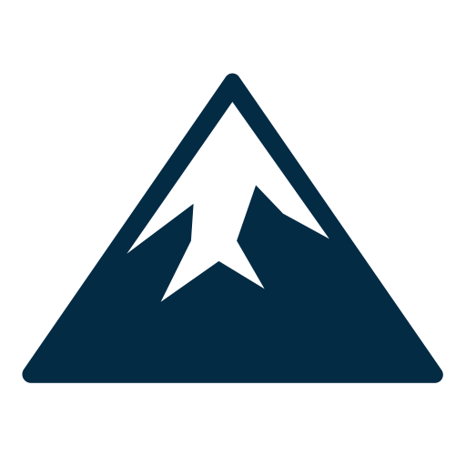

# tonybrierly.com
<a id="readme-top"></a>
<!-- PROJECT LOGO -->
<br />
<div align="center">
  <a href="https://github.com/tonyb650/portfolio">
    
  </a>

  <h3 align="center">Personal Website </h3>

  <p align="center">
    A resource for anyone who is interested in my work as a web developer: <a href="https://tonybrierly.com">tonybrierly.com</a>
    <br />
  </p>
</div>


<!-- TABLE OF CONTENTS -->
<details>
  <summary>Table of Contents</summary>
  <ol>
    <li>
      <a href="#about-the-project">About The Project</a>
      <ul>
        <li><a href="#built-with">Built With</a></li>
      </ul>
    </li>
    <li>
      <a href="#getting-started">Getting Started</a>
      <ul>
        <li><a href="#prerequisites">Prerequisites</a></li>
        <li><a href="#installation">Installation</a></li>
      </ul>
    </li>
    <li><a href="#usage">Usage</a></li>
    <li><a href="#roadmap">Roadmap</a></li>
    <li><a href="#license">License</a></li>
    <li><a href="#contact">Contact</a></li>
    <li><a href="#acknowledgments">Acknowledgments</a></li>
  </ol>
</details>


<!-- ABOUT THE PROJECT -->
## About The Project

This website serves as a resource for anyone who wants to find out more about me or see my work.

It also serves as a great frontend practice project for me with an emphasis on animation. I wanted to practice various techniques so I utilized several different methods for animation: CSS, SVG, and Framer.

I also wanted a bit more interactivity, so I added a LLM chatbot using OpenAI SDK.

This SPA is split into 4 sections:
* An introductory *About* section
* A *Projects* section to provide information about some of my notable work
* A *Robot Me* section that uses a static knowledge base combined with LLM calls to answer users' questions about me. This also incorporates tools that fire push notifications to my phone when a user wants to connect and provides their email, or when the knowledge base is insufficient to for answering a user's question.
* A *Contact* section with form-to-email functionality.

<p align="right">(<a href="#readme-top">back to top</a>)</p>

### Built With
[![NextJS][Next.js]][NextJS-url]\
[![TailwindCSS][TailwindCSS.com]][Tailwind-url]\
[![Framer][Framer.com]][Framer-url]\
[![OpenAI][Openai.com]][Openai-url]


<p align="right">(<a href="#readme-top">back to top</a>)</p>


<!-- GETTING STARTED -->
## Getting Started

**NOTE**: *Obviously, this project is a personal website. That said, if any part of it can be useful to you, it is freely available.* To get a local copy up and running, follow these steps:

### Prerequisites

Node and NPM are required.
  ```sh
  npm install npm@latest -g
  ```

### Installation
1. Clone the repo
   ```sh
   git clone https://github.com/tonyb650/portfolio.git
   ```
2. Install packages with `npm`
   ```sh
   cd portfolio && npm install
   ```
3. Create `.env` file and populate with environment variables. See `.env.example`
4. Change git remote url to avoid accidental pushes to base project
   ```sh
   git remote set-url origin github_username/repo_name
   git remote -v # confirm the changes
   ```
5. Run the application
   ```sh
   npm run dev
   ```

<p align="right">(<a href="#readme-top">back to top</a>)</p>


<!-- USAGE EXAMPLES -->
## Usage

![About Section Screen Shot][about-screenshot]

<p align="right">(<a href="#readme-top">back to top</a>)</p>


<!-- ROADMAP -->
## Roadmap

This is v1 of my personal website. I intend to add new projects to it as I complete them and make a v2, etc. as time allows.

<p align="right">(<a href="#readme-top">back to top</a>)</p>


<!-- LICENSE -->
## License

Distributed under the Unlicense License. See `LICENSE.txt` for more information.

<p align="right">(<a href="#readme-top">back to top</a>)</p>


<!-- CONTACT -->
## Contact

Tony Brierly

[![LinkedIn][linkedin-shield]][linkedin-url]

Deployed project: [tonybrierly.com](https://tonybrierly.com)

<p align="right">(<a href="#readme-top">back to top</a>)</p>


<!-- ACKNOWLEDGMENTS -->
## Acknowledgments

* [Vecteezy](https://www.vecteezy.com/free-png/hands)
* [Zoop Animation](https://www.youtube.com/watch?v=blUpQMJjObE)
* [Inspiration for Project Card Component](https://www.hover.dev/components/cards)
* [Bouncing Balls Animation](https://www.youtube.com/watch?v=mqPbfNwUJRI)
* [Underline Animation](https://stackoverflow.com/questions/70906977/tailwind-underline-hover-animation)
* [Color Scheme](https://www.pinterest.com/pin/264164334380470991/)
* [Slide-over for mobile menu](https://www.youtube.com/watch?v=RI9sG74RSq8)
* [Animated hamburger menu](https://www.youtube.com/watch?v=JLfBo4p9ANw)
* [Smooth Scrolling](https://www.youtube.com/watch?v=MjHlltcA-nA)
* [Inspiration for Particle Animation](https://www.youtube.com/watch?v=m9fXNVFC1qI)
* [Best Readme Template](https://github.com/othneildrew/Best-README-Template)
* [Choose an Open Source License](https://choosealicense.com)
* [Img Shields](https://shields.io)
* [React Icons](https://react-icons.github.io/react-icons/search)

<p align="right">(<a href="#readme-top">back to top</a>)</p>


<!-- MARKDOWN LINKS & IMAGES -->
<!-- https://www.markdownguide.org/basic-syntax/#reference-style-links -->

[about-screenshot]: public/images/about_screenshot.png

[linkedin-shield]: https://img.shields.io/badge/-LinkedIn-black.svg?style=for-the-badge&logo=linkedin&colorB=555
[linkedin-url]: https://linkedin.com/in/tony-brierly

[Next.js]: https://img.shields.io/badge/Nextjs-000000?style=for-the-badge&logo=next.js&logoColor=ffffff
[Nextjs-url]: https://nextjs.org/

[TailwindCSS.com]: https://img.shields.io/badge/tailwindcss-041f30?style=for-the-badge&logo=tailwindcss&logoColor=00bcff
[Tailwind-url]: https://tailwindcss.com

[Framer.com]: https://img.shields.io/badge/framer-000000?style=for-the-badge&logo=framer&logoColor=0055ff
[Framer-url]: https://framer.com/

[Openai.com]: https://img.shields.io/badge/OpenAI-412991?style=for-the-badge&logo=openai&logoColor=white
[Openai-url]: https://platform.openai.com/
